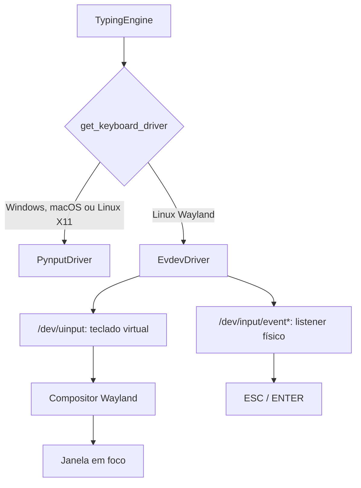

# Suporte ao Wayland no AutoTyper

Este documento descreve a estratégia do AutoTyper para sessões Linux com Wayland e os limites conhecidos. A arquitetura baseada em `evdev` e `/dev/uinput` é tecnicamente viável quando o sistema concede as permissões necessárias e o compositor aceita o dispositivo virtual como teclado. Ela não é uma garantia universal nem substitui a validação no ambiente de destino.

## 1. O desafio no Wayland

No X11, bibliotecas como `pynput` podem usar extensões X11 para observar eventos globais e enviar teclas sintéticas. No Wayland, clientes são isolados: uma aplicação comum não pode ler as teclas de outra janela nem injetar eventos globais pela camada Xwayland em aplicações Wayland nativas.

Por isso, o AutoTyper precisa distinguir duas capacidades independentes:

| Capacidade | Mecanismo proposto | Permissão necessária |
| --- | --- | --- |
| Digitar na janela em foco | Criar teclado virtual em `/dev/uinput` | Acesso de escrita a `/dev/uinput` |
| Abortar com `ESC` e avançar blocos com `ENTER` | Ler teclados físicos em `/dev/input/event*` | Acesso de leitura aos nós de evento relevantes |

Ter acesso a `/dev/uinput` não implica ter acesso aos dispositivos em `/dev/input/event*`, nem o inverso. O produto só deve declarar o recurso plenamente disponível depois de testar as duas capacidades.

## 2. Situação da implementação atual

A implementação seleciona `EvdevDriver` em sessões Linux detectadas como Wayland e usa `PynputDriver` nos demais casos. O driver evdev cria um dispositivo virtual via `/dev/uinput` e tenta ler os teclados físicos para observar `ESC` e `ENTER`.

Há limitações que ainda exigem correção no código antes de se prometer suporte completo:

- A disponibilidade é verificada somente para `/dev/uinput`. Caso não seja possível abrir nenhum teclado físico, o listener pode encerrar sem aviso. No modo por blocos, isso pode deixar a aplicação aguardando `ENTER` indefinidamente.
- O mapeamento de texto é de teclado US e ASCII. Caracteres fora desse conjunto, como `ç`, `ã`, `é` e `€`, podem ser descartados silenciosamente; pontuação também pode divergir em ABNT2.
- O fallback para `pynput` preserva o comportamento em X11, mas não torna a injeção nem o listener globais funcionais em Wayland. Um import antecipado de `pynput` também pode impedir a inicialização em sessões sem Xwayland disponível.
- A interface consulta a disponibilidade aparente de `uinput`, não o backend efetivamente inicializado. Ela pode anunciar evdev ativo após uma falha de criação; os erros de inicialização devem ser preservados e o estado exibido deve refletir o driver e o listener reais.
- O listener vê o `ENTER` físico sem suprimi-lo e o mecanismo de digitação pode emitir outro `ENTER`. Em terminais e consoles remotos, isso pode executar uma ação adicional.
- Reconexão de teclados (hotplug), desconexão de dispositivos e a comunicação do estado do listener para a interface ainda precisam ser definidos e tratados.

## 3. Arquitetura viável, condicionada ao ambiente



Quando `/dev/uinput` é acessível, o driver pode publicar um teclado virtual no subsistema de entrada do kernel. O compositor normalmente recebe os eventos como os de um dispositivo de entrada; o resultado, porém, depende da política do compositor, do assento/sessão, do hardware virtualizado e das permissões locais. Portanto, a compatibilidade deve ser descrita por ambientes testados, não por uma afirmação de funcionamento em qualquer janela ou distribuição.

Para digitação de texto, a correção proposta é introduzir suporte explícito ao layout selecionado (ao menos US e ABNT2) ou recusar caracteres não mapeáveis com erro visível. Nunca se deve descartar caracteres sem informar o usuário.

Para os controles, a inicialização deve testar separadamente a criação do teclado virtual e a abertura de ao menos um teclado físico adequado. Se a segunda etapa falhar, a interface deve deixar claro que `ESC` e o avanço por `ENTER` não estão disponíveis e não iniciar um modo que dependa deles. O driver também precisa reagir a hotplug e atualizar esse estado na interface.

No modo por blocos, o contrato deve evitar o `ENTER` duplicado: pressionar `ENTER` pode apenas liberar o próximo bloco, ou pode ser encaminhado uma única vez de forma deliberada, mas a política deve ser única, documentada e coberta por teste de integração.

## 4. Permissões e configuração

Não presuma que `systemd-logind` concederá automaticamente acesso a ambos os tipos de dispositivo. A tag udev `uaccess` pode conceder ACLs para uma sessão local ativa, mas sua presença e efeito variam com a distribuição, o tipo de sessão e as regras instaladas.

Os comandos abaixo são exemplos de diagnóstico a adaptar ao ambiente; não foram executados como parte deste plano. Verifique cada requisito separadamente:

```bash
getfacl /dev/uinput
ls -l /dev/input/event*
getfacl /dev/input/event0
```

O último caminho é apenas um exemplo: deve-se inspecionar os dispositivos que correspondem a teclados físicos, sem assumir que `event0` seja um deles.

Caso seja necessária uma regra local para `uinput`, ela deve ser avaliada pela distribuição e instalada antes de `73-seat-late.rules`, que é a regra que aplica as ACLs de assento. Por exemplo, um nome como `/etc/udev/rules.d/70-autotyper-uinput.rules` é processado antes de `73-seat-late.rules`; `99-uinput.rules` pode ser tarde demais para esse fluxo.

```udev
KERNEL=="uinput", SUBSYSTEM=="misc", TAG+="uaccess"
```

Após criar ou alterar regras udev, recarregue-as e reconecte ou reavalie o dispositivo conforme a documentação da distribuição. A regra para `uinput` só trata a criação do teclado virtual; ela não autoriza a leitura de `/dev/input/event*`.

Adicionar o usuário ao grupo `input` dá acesso amplo aos eventos globais de entrada, com potencial de captura de teclas de outras aplicações. Não é uma solução segura ou universal e não deve ser recomendada como configuração padrão. A autorização para leitura de `event*` deve ser uma decisão administrativa independente, limitada ao menor escopo possível e registrada com esse risco.

## 5. Fallback e alternativas

Em Windows, macOS e Linux X11, `PynputDriver` continua sendo a rota normal. Em Wayland, uma falha no evdev não deve ser apresentada como fallback funcional para `pynput`: Xwayland pode estar ausente e, mesmo presente, não fornece injeção ou escuta global para janelas Wayland nativas. O carregamento de `pynput` deve ser adiado até que esse backend seja de fato selecionado.

`ydotool` e `dotool` seguem o mesmo modelo de privilégio de `/dev/uinput`; podem simplificar a implementação, mas adicionam dependências e não eliminam a necessidade de autorização. Protocolos de teclado virtual específicos de compositor atendem somente parte do ecossistema.

`libei` e o XDG RemoteDesktop Portal são uma alternativa de menor privilégio quando o backend do ambiente a suporta. A persistência de autorização não deve ser presumida: o portal define `persist_mode` e `restore_token`, mas a disponibilidade e o comportamento dependem do backend do portal e da política do usuário e do compositor.

Essa alternativa atende à injeção de entrada; ela não fornece, por si só, a escuta global de `ESC` e `ENTER`. Os controles de interrupção e avanço precisam de uma solução separada, validada no ambiente escolhido.

## 6. Riscos operacionais e de segurança

- Permitir leitura de `event*` equivale, na prática, a permitir observação global de teclado. O acesso deve ser limitado a usuários e sessões explicitamente autorizados.
- Um teclado virtual com acesso a `uinput` pode digitar na janela em foco. Erro de foco ou de sincronização pode enviar comandos ao destino errado.
- Um listener indisponível reduz a capacidade de abortar uma operação. A interface deve expor a condição antes de iniciar a digitação.
- O comportamento pode mudar em sessões remotas, máquinas virtuais, telas de bloqueio, sandboxing, múltiplos assentos e após reconexão de dispositivos.

## 7. Matriz e checklist de validação

Antes de declarar uma combinação como suportada, validar e registrar o resultado para cada ambiente alvo:

| Dimensão | Casos mínimos |
| --- | --- |
| Compositor | KDE Plasma/KWin, GNOME/Mutter e os compositores wlroots que serão suportados |
| Sessão | Wayland sem Xwayland/`DISPLAY`; login local, sessão remota e máquina virtual quando aplicável |
| Permissões | `/dev/uinput` permitido; somente `event*` negado; somente `uinput` negado; ambos negados |
| Layout | US e ABNT2; texto com acentos, cedilha, símbolos e caracteres deliberadamente não suportados |
| Controles | `ESC` interrompe; `ENTER` avança uma vez; listener indisponível é informado; hotplug atualiza o estado |
| Destino | Terminal, navegador, console/KVM e o console remoto efetivamente usado |
| Regressão | X11, Windows e macOS mantêm o comportamento esperado |

Este documento define o plano e seus critérios; ele não afirma que essa matriz já foi executada. A compatibilidade divulgada deve ser atualizada somente com resultados observados nesses testes.

## Referências

- [Linux kernel: uinput](https://docs.kernel.org/input/uinput.html)
- [systemd: `70-uaccess.rules`](https://raw.githubusercontent.com/systemd/systemd/main/rules.d/70-uaccess.rules.in)
- [systemd: `73-seat-late.rules`](https://raw.githubusercontent.com/systemd/systemd/main/rules.d/73-seat-late.rules.in)
- [pynput: limitações em Wayland](https://pynput.readthedocs.io/en/latest/limitations.html)
- [XDG RemoteDesktop Portal](https://flatpak.github.io/xdg-desktop-portal/docs/doc-org.freedesktop.portal.RemoteDesktop.html)
